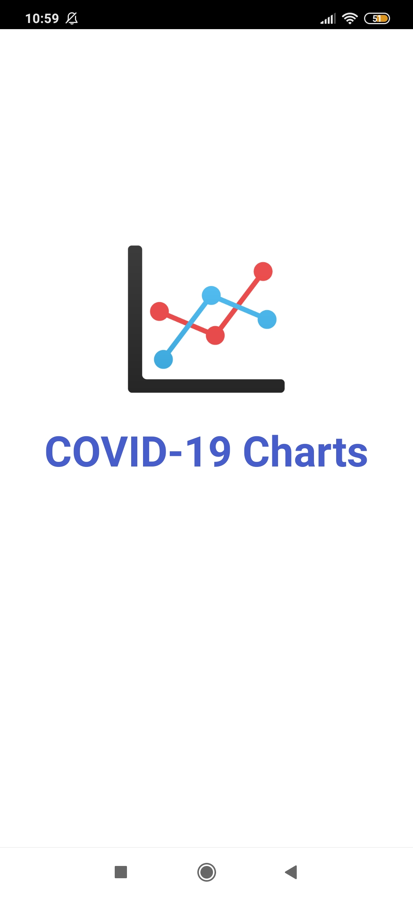
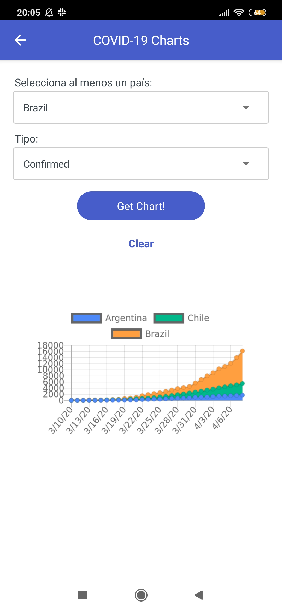

# mat|r COVID-19 Charts App
Data and code of COVID-19 Charts App, a mobile application I developed with [mat|r script](https://www.matrproject.com/).

This app allows you to display line charts of confirmed, deceased and recovered cases by country with data from the last 30 days. It also allows to plot curves from different countries at the same time for comparison.

**Programming Language:** mat|r script

